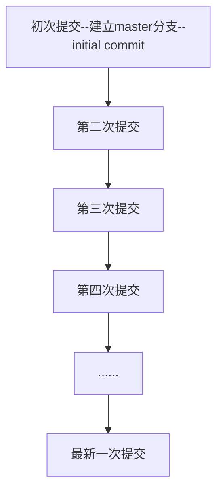

### 资源

[git拉取指定的远程分支(三种方式)]()

### 分支与版本

如果我们没有创建分支的话，提交都默认是在master分支上面提交。

仓库刚建好，还没有提交的时候，这个时候没有分支。

第一次提交的时候默认建立一个master分支，提交到该分支上。

每次提交都相当于标记了一个版本，之后可以根据版本号还原仓库文件到这一次提交时的样子。

提交在单分支上就好像在一串项链上不断串上新的珠子

我们可以很轻易地还原到之前任意一次提交对应的版本处。

而多分支的提交，可以帮助我们在同一个基础上去试探多种可能。重要的是可以帮助我们简化分支层次