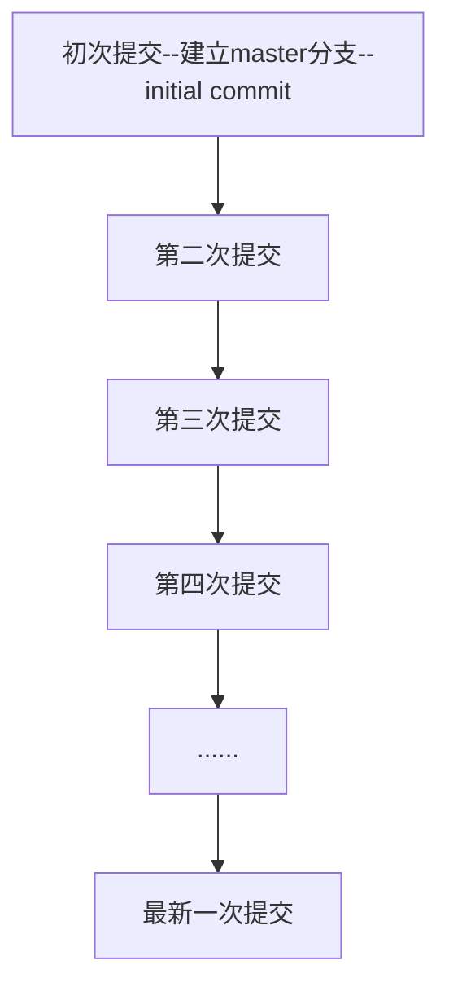
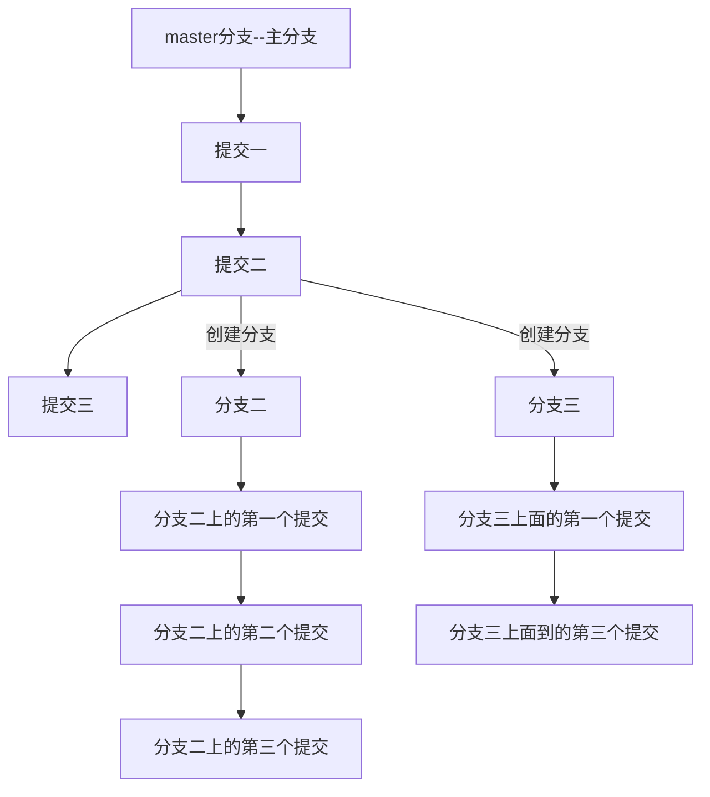

### 资源

[git拉取指定的远程分支(三种方式)]()

### 分支与版本

如果我们没有创建分支的话，提交都默认是在master分支上面提交。

仓库刚建好，还没有提交的时候，这个时候没有分支。

第一次提交的时候默认建立一个master分支，提交到该分支上。

每次提交就是生成一个当前提交对应的版本，之后可以根据版本号还原仓库文件到这一次提交时的版本。

（笔记里的版本和很多其他博客上的提交是同一个意思)

提交在单分支上就好像在一串项链上不断串上新的珠子



而多分支中的提交就好像选择树的一个分支新生长一片叶子



在分支中使用git log只能够看到分支继承的主枝总的版本以及分支中的版本。但是看不到其他分支的版本。

### 分支的作用

1. 分支的概念能够辅助我们进行版本管理。

   一个分支把相关的版本集合起来，删除分支就能够把对应的版本都删除掉。

2. 用来尝试一些大胆的想法

3. 用来暂时存放拉取的远程分支

   比如新建本地分支存储拉来的远程分支，然后再与主分支合并。

### 操作

#### 如何创建本地分支

仓库建立后，在第一次提交时会默认建立一个master分支(主分支)

1. 创建分支命令:

   ```javascript
   git branch xxx
   ```

2. 创建并签出分支

   ```javascript
   git checkout -b yyy
   ```

   该行命令会创建一个继承自当前分支的

#### 如何查看分支

1. 查看本地分支

   ```javascript
   git branch
   ```

2. 查看远程分支

   ```javascript
   git branch -r
   ```

3. 查看所有分支

   ```javascript
   git branch -a
   ```

#### 如何签出分支

签出分支是术语，意思是:

```javascript
从当前分支转移到要签出的分支。
比如当前处于master分支，此外本地存在gg和dd分支。
在master分支输入命令签出到gg分支，则当前分支会转移到gg.
```

1. 签出分支命令

   ```javascript
   git checkout xx
   签出到xx分支
   ```

   checkout后面跟想要签出的分支名，如果对应分支不存在，则会报错

#### 如何删除分支

1. 删除本地分支

   ```javascript
   git branch -d 本地分支名
   ```

2. 强制删除本地分支(1中命令无效时可以采用该命令)

   ```javascript
   git branch -D 本地分支名
   ```

#### 从远程拉取指定分支到本地指定分支处

1. 任务：

   ```javascript
   从远程仓库origin拉取分支master到本地的分支rr处
   origin是自定义的远程仓库名，master是远程仓库的一个分支，rr是本地存在的一个分支
   ```

2. 方法一：

   ```javascript
   git pull origin master:rr
   ```

3. 方法二：